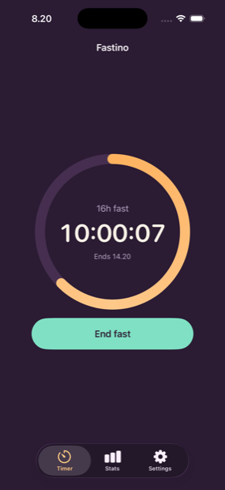

# Fastino

A minimal iOS intermittent-fasting tracker. Logging a fast should be nearly invisible — one tap, or a double-tap on the back of the phone — while the statistics stay comprehensive and out of the way until you ask for them.

No accounts, no backend, no analytics, no subscriptions. Your data stays on your device.

<p align="center">
  
</p>

## Features

**Timer.** One progress ring covering the whole cycle: amber while you're fasting, blooming to mint once you pass the goal and continuing to count, then lilac for the eating window that follows, counting down to when the next fast is due. Each state shows a live readout and the clock time it ends.

**Your schedule doesn't drift.** You pick the time you start fasting, and the eating window closes at that time every day. Fast two hours longer than planned and you've spent two hours of today's eating window — you haven't pushed tomorrow's start two hours later.

**Protocols.** 14:10, 16:8, 18:6, 20:4 and OMAD (23:1). The goal is snapshotted when a fast starts, so changing protocol never rewrites history.

**Streaks and stats.** Current and longest streak, current and longest fast, a seven-day strip, and 30-day average duration and goal-completion rate. Everything is derived from stored fasts — nothing is cached, so edits recompute cleanly.

Streaks are strict by design: no freezes, no rest days. A goal day is a calendar day on which a completed fast *ended*, which means a fast spanning midnight credits exactly one day.

**History and editing.** Reverse-chronological, grouped by month. Edit start, end or note; add a fast you forgot to log; delete. Validated against overlaps, backwards times and implausible durations.

**Notifications.** A celebratory alert when you hit your goal, and a daily start reminder at your chosen start time — the same moment your eating window closes. Suppressed automatically while a fast is already running.

**Shortcuts, Siri and Back Tap.** "Hey Siri, start fasting" / "stop fasting" — Start and End ship as App Shortcuts, with app-name aliases so the phrase reads naturally. A state-aware `Toggle` intent lives in the Shortcuts app and asks for confirmation, which is what makes it safe to bind to a Back Tap double-tap — the app's headline interaction.

**Calm by default.** Deep aubergine or cream paper rather than a clinical white dashboard, rounded numerals, and celebrations that last under a second and respect Reduce Motion. Missing a goal is reported neutrally, never with shame.

## Requirements

- iOS 26.4 or later (iPhone and iPad)
- Xcode 26.x

## Building

```bash
# Run in the simulator
xcodebuild build -scheme Fastino -destination 'platform=iOS Simulator,name=iPhone 17'

# Tests
xcodebuild test -scheme Fastino -destination 'platform=iOS Simulator,name=iPhone 17' -only-testing:FastinoTests

# A single suite
xcodebuild test -scheme Fastino -destination 'platform=iOS Simulator,name=iPhone 17' \
  -only-testing:FastinoTests/CurrentStreakTests
```

Or just open `Fastino.xcodeproj` and hit Run.

Two debug-only launch arguments seed sample data for screenshots: `-seedDemo` (a streak plus an active fast) and `-seedEating` (the between-fasts state).

## Architecture

SwiftUI and SwiftData throughout, in three layers:

**A pure core** — `Model/FastRecord.swift`, `Engine/FastingEngine.swift`, `Engine/FastValidation.swift`. Every streak, statistic and validation rule is a pure function of `[FastRecord]` plus a reference time and time zone. No SwiftData, no globals, no I/O. This is the layer with the exhaustive test suite: midnight spans, DST, time-zone shifts, overlaps and retroactive edits.

**Persistence and a single write path** — `Store/FastStore.swift` is the only place a fast is ever mutated. The UI and the App Intents all go through it, so validation, notification scheduling and widget reloads happen identically no matter where a fast was started from. The SwiftData models keep every attribute defaulted and avoid unique constraints, which keeps the schema CloudKit-compatible.

**Surfaces** — three tabs (Timer, Stats, Settings), plus the App Intents.

Tests use swift-testing (`@Suite` / `@Test`): 55 tests across 9 suites, all against the pure core.

### Not built yet

The engine and intents are structured for reuse by these, but each needs an additional Xcode target:

- Lock Screen and Home Screen widgets
- watchOS app and complications
- CloudKit sync — the schema is already compatible; enabling it means setting a real container identifier in `Fastino.entitlements` and flipping `cloudKitDatabase` to `.automatic` in `Store/AppContainer.swift`

## Documentation

- [`specification.md`](specification.md) — the product and technical specification, and the source of truth. Source files reference its sections (`§2`, `§4.6`) in their headers.
- [`IMPLEMENTATION.md`](IMPLEMENTATION.md) — what is built versus deferred.
- [`CLAUDE.md`](CLAUDE.md) — orientation for AI coding agents.

## Privacy

There is no backend, no telemetry and no analytics SDK. Fasts are stored locally via SwiftData. Notifications are scheduled on-device and permission is requested lazily — the first time it would actually be useful, not on launch.

## License

[MIT](LICENSE) © 2026 Francesco Balestrieri
